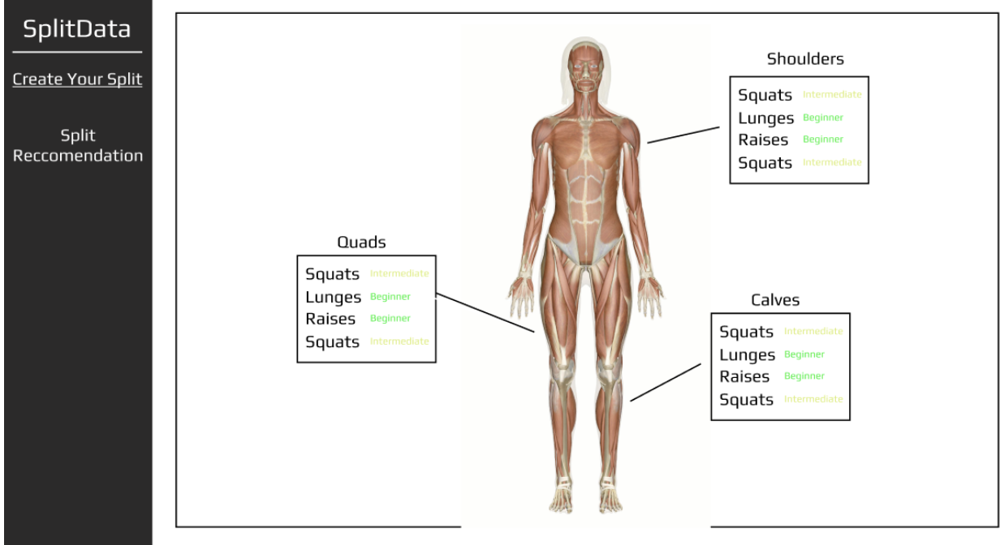

# team117

## Basic Information

|   Info      |        Description     |
| ----------- | ---------------------- |
| TeamID      |        Team-117        |
| TeamName    |         abcd         |
| Captain     |       Kazmain Shah    |
| Captain     |  kshah228@illinois.edu  |
| Member1     |     Sona Krishnan      |
| Member1     |  sonavk2@illinois.edu   |
| Member2     |    Nathan Parekh      |
| Member2     |   nparekh4@illinois.edu|
| Member3     |     Sana Affakh          |
| Member3     |       naffakh3@illinois.edu      |

## Project Information

|   Info      |        Description     |
| ----------- | ---------------------- |
|  Title      |       SplitData     |
| System URL  |      link_to_system    |
| Video Link  |      link_to_video     |

## Project Summary

#### Title: SplitData

#### Summary: 
Our project SplitData is an app that personalizes your workout schedule based on your goals and abilities. It will create workout plans that fit your schedule, prioritize your preferred muscle groups, and build your desired athletic skill sets, all while making sure that you are not neglecting any areas in your training.

#### Usefulness:
Many of us experience a plateau in our fitness journey, often due to repetitive routines and uncertainty about how to challenge ourselves effectively. Our app aims to elevate the workouts of recreational gym-goers by providing personalized training plans that adapt to each user's progress. By setting tailored goals and benchmarks, the app encourages users to continually push their limits and enhance their performance. With insights and recommendations that evolve alongside their fitness journey, users can break through barriers, discover new strengths, and achieve their desired results with confidence. 

#### Realness (datasets):
[https://app.gigasheet.com/spreadsheet/gym-exercise-dataset/bcb08ead_e277_4e74_89d1_70504656ab9f?_gl=1*1mc5nqj*_gcl_au*MTE1NDQ4MjczMS4xNzI2NTIzNDc2](https://app.gigasheet.com/spreadsheet/gym-exercise-dataset/bcb08ead_e277_4e74_89d1_70504656ab9f_gl=1*1mc5nqj*_gcl_au*MTE1NDQ4MjczMS4xNzI2NTIzNDc2):

"The megaGymDataset.csv table contains information on 2918 gym exercises, including titles, descriptions, types, body parts targeted, equipment needed, difficulty levels, ratings, and rating descriptions. This dataset can be used to analyze popular exercises, create personalized workout plans, and assess the effectiveness of different types of workouts"

--

[https://www.kaggle.com/datasets/aadhavvignesh/calories-burned-during-exercise-and-activities/data](https://www.kaggle.com/datasets/aadhavvignesh/calories-burned-during-exercise-and-activities/data):

"Calories Burned During Exercise and Activities
Dataset containing the amount of calories burned during several activities."

--

[https://data.world/coreyhermanson/toughest-sport-by-skilldata.world](https://data.world/coreyhermanson/toughest-sport-by-skilldata.world):

60 sports ranked across 10 skill categories by ESPN panel to determine what skillsets are prioritized by each sport. (strength, flexibility, endurance, coordination, etc.)

#### Functionality: 
- User preference quiz to determine their goals and current skill level
- Creates plan with workouts that help them achieve their goals
- setting tailored goals and benchmarks
- Recommendations to help them understand exercise movement better, and continue to push themselves in the gym
- **Creative Component:** Clickable muscular skeleton that you can click to choose which muscles to work and it will query all the muscles for that muscle group	

#### Mockup:

#### Workflow:
We will all work on the UI/UX for the first 3 weeks
	Muscle Visualization component: Sana, Kaz
User Quiz component: Sona, Nathan
For the middle part of the semester:
	We will split up and work on the backend
The end of the semester:
	We will focus on improving both our front and backend
